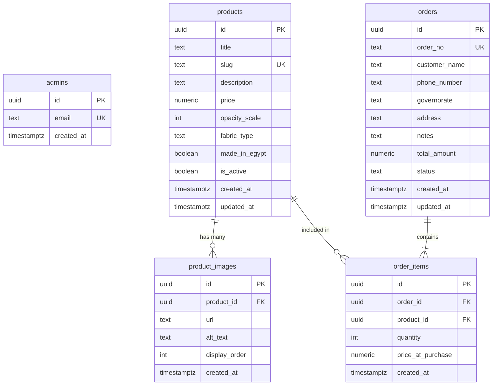

# Entity Relationship Diagram (ERD): FADFAAD

## Data Lifecycle Summary

1.  **Product Management:** Admin creates a `product`. They upload one or more `product_images` linked via `product_id`.
2.  **Order Placement:** Customer (Anonymous) selects products. A record is inserted into `orders` (triggering the `FDF-` sequence).
3.  **Order Line Items:** Each item selected is inserted into `order_items`. `price_at_purchase` is captured to ensure the order record remains accurate if the main `products` price is updated later.
4.  **Admin Fulfillment:** Admin logs in and updates the `orders.status`.
